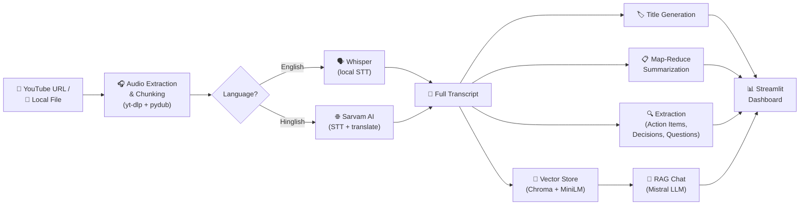

<div align="center">

# 🎬 AI Video Assistant

**Turn any video or YouTube link into a searchable, summarized, chat‑ready meeting brief.**

Transcribe → Summarize → Extract → Chat — all in one pipeline, powered by **Whisper**, **Mistral AI**, and **RAG**.

[](https://www.python.org/)
[](https://streamlit.io/)
[](https://www.langchain.com/)
[](https://mistral.ai/)
[](https://www.trychroma.com/)
[](#-license)

</div>

---

## 📖 Overview

**AI Video Assistant** is an end‑to‑end pipeline that takes a **YouTube URL or a local audio/video file** and turns it into a complete, queryable meeting/video intelligence report:

- 📝 Full transcript (English or Hindi→English via Sarvam AI)
- 🏷️ Auto‑generated title
- 📋 Professional summary (map‑reduce style, works on long recordings)
- ✅ Action items with owner & deadline
- 🔑 Key decisions
- ❓ Open / unresolved questions
- 💬 A RAG‑powered chatbot to ask follow‑up questions about the content

It ships with two front doors: a **Streamlit web UI** with a custom dark, "control room" themed interface, and a **CLI** for quick terminal use.

---

## 🧭 Pipeline at a Glance



---

## ✨ Features

| Category | Details |
|---|---|
| 🎥 **Flexible Input** | Accepts a YouTube URL *or* a local audio/video file path |
| 🔊 **Smart Audio Handling** | Auto-downloads/converts to WAV, resamples to 16kHz mono, and chunks long recordings (10‑min segments) |
| 🗣️ **Dual Transcription Engines** | **Whisper** (local, offline) for English · **Sarvam AI** (`saaras:v2.5`) for Hindi/Hinglish → English translation |
| 📋 **Map‑Reduce Summarization** | Splits long transcripts into chunks, summarizes each, then merges into one polished summary — scales to long meetings |
| 🔍 **Structured Extraction** | Pulls out action items (task / owner / deadline), key decisions, and open questions as clean numbered lists |
| 🧠 **RAG Chat** | Ask natural‑language questions about the transcript; answers are grounded strictly in the retrieved context (Chroma + `all-MiniLM-L6-v2` embeddings) |
| 🖥️ **Custom UI** | Dark "terminal/control‑room" themed Streamlit dashboard with live pipeline status, cards, and a chat widget |
| ⌨️ **CLI Mode** | Run the full pipeline and chat with your video straight from the terminal |

---

## 🛠️ Tech Stack

<div align="center">

| Layer | Technology |
|---|---|
| **UI** | Streamlit, streamlit‑extras |
| **Audio Acquisition** | yt‑dlp, pydub, ffmpeg-python |
| **Speech‑to‑Text** | OpenAI Whisper (local) · Sarvam AI STT‑Translate API (Hindi → English) |
| **LLM Orchestration** | LangChain (LCEL) + `langchain-mistralai` |
| **LLM** | Mistral AI (`mistral-small-latest`) |
| **Embeddings / Vector DB** | HuggingFace `sentence-transformers` (`all-MiniLM-L6-v2`) + ChromaDB |
| **Export** | ReportLab, fpdf2 |

</div>

---

## 📂 Project Structure

```
ai_video_assistant/
├── app.py                     # Streamlit web app (custom-styled dashboard)
├── main.py                    # CLI entry point
├── requirements.txt
├── core/
│   ├── extractor.py           # Action items / decisions / open questions
│   ├── rag_engine.py          # RAG chain: retrieval + Mistral LLM
│   ├── summarize.py           # Map-reduce summarization + title generation
│   ├── transcriber.py         # Whisper + Sarvam AI transcription routing
│   └── vector_store.py        # Chroma vector store build/load + retriever
└── utils/
    └── audio_processor.py     # YouTube download, WAV conversion, chunking
```

---

## 🚀 Getting Started

### 1. Prerequisites

- Python **3.10+**
- **FFmpeg** installed and available on your `PATH` ([download](https://ffmpeg.org/download.html))
- A [Mistral AI](https://console.mistral.ai/) API key
- *(Optional, for Hinglish)* A [Sarvam AI](https://www.sarvam.ai/) API key

### 2. Clone & Install

```bash
git clone https://github.com/222000rohitkumar/ai_video_assistant.git
cd ai_video_assistant

python -m venv venv
source venv/bin/activate     # Windows: venv\Scripts\activate

pip install -r requirements.txt
```

### 3. Configure Environment Variables

Create a `.env` file in the project root:

```env
MISTRAL_API_KEY=your_mistral_api_key_here
SARVAM_API_KEY=your_sarvam_api_key_here   # optional, needed only for hinglish mode
WHISPER_MODEL=small                       # tiny | base | small | medium | large
```

### 4. Run It

**Streamlit UI:**

```bash
streamlit run app.py
```

Then open the local URL Streamlit prints, paste a YouTube link or local file path into the sidebar, pick a language, and hit **⚡ Analyse**.

**CLI:**

```bash
python main.py
```

You'll be prompted for a source and language, then dropped into an interactive chat session once processing completes.

---

## 🖥️ How the Dashboard Works

1. **Input** — paste a YouTube URL or local file path in the sidebar, choose `english` or `hinglish`
2. **Live Pipeline Status** — a sidebar checklist lights up as each stage completes: Audio → Transcription → Title → Summary → Extraction → RAG
3. **Results View** — title banner, summary card, collapsible full transcript, and three side‑by‑side cards for action items, decisions, and open questions
4. **Chat** — a chat panel at the bottom lets you ask follow‑up questions; answers are generated strictly from the transcript via the RAG chain

---

## 🧩 Core Modules

| Module | Responsibility |
|---|---|
| `utils/audio_processor.py` | Downloads YouTube audio via `yt-dlp`, converts local files to 16kHz mono WAV, and splits into 10‑minute chunks |
| `core/transcriber.py` | Routes each chunk to **Whisper** (English) or **Sarvam AI** (Hinglish, sliced into ≤25s pieces to respect the API's 30s limit) |
| `core/summarize.py` | Splits the transcript (3000‑char chunks), summarizes each with Mistral, then combines into one final bullet‑point summary; also generates a short title |
| `core/extractor.py` | Runs three focused LLM prompts to extract action items, key decisions, and open questions |
| `core/vector_store.py` | Chunks the transcript (500 chars), embeds with `all-MiniLM-L6-v2`, and stores/retrieves via ChromaDB |
| `core/rag_engine.py` | Builds an LCEL RAG chain — retriever → prompt → Mistral LLM — that answers questions grounded only in retrieved transcript context |

---

## 🗺️ Roadmap

- [ ] PDF / TXT export of summary & extraction results
- [ ] Speaker diarization
- [ ] Support for more languages beyond Hinglish
- [ ] Persisted chat history per session
- [ ] Dockerized deployment

---

## 🤝 Contributing

Contributions, issues, and feature requests are welcome!
Feel free to check the [issues page](https://github.com/222000rohitkumar/ai_video_assistant/blob/main/LICENSE) or open a pull request.

---

## 📄 License

This project is currently unlicensed. Consider adding an [MIT License](https://choosealicense.com/licenses/mit/) if you intend for others to freely use and modify this project.

---

<div align="center">

Made with ⚡ by [**222000rohitkumar**](https://github.com/222000rohitkumar)

</div>
